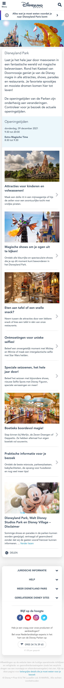
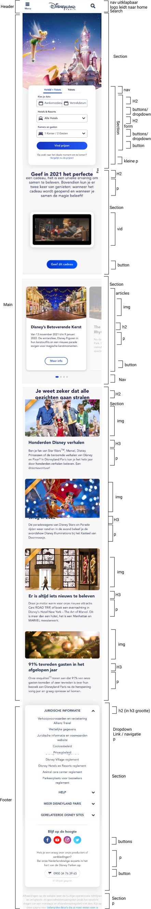
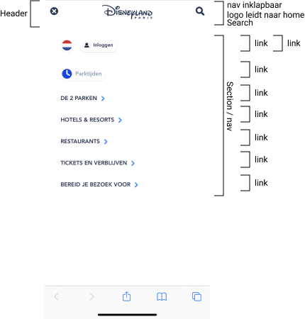
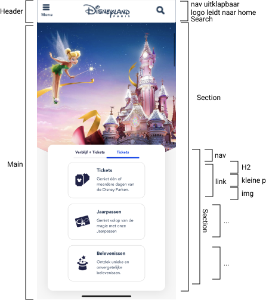
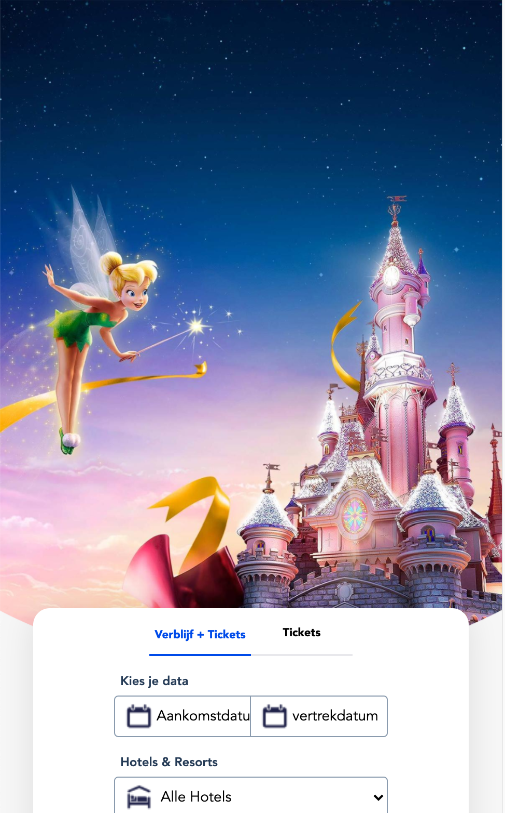
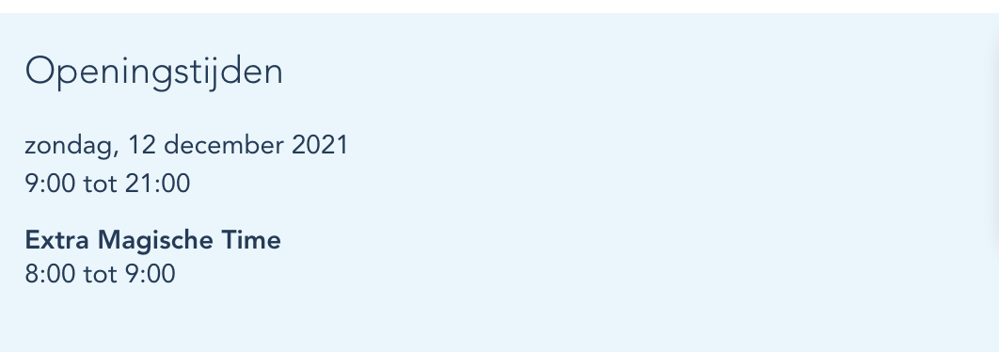

# Procesverslag
Markdown is een simpele manier om HTML te schrijven.  
Markdown cheat cheet: [Hulp bij het schrijven van Markdown](https://github.com/adam-p/markdown-here/wiki/Markdown-Cheatsheet).

Nb. De standaardstructuur en de spartaanse opmaak van de README.md zijn helemaal prima. Het gaat om de inhoud van je procesverslag. Besteedt de tijd voor pracht en praal aan je website.

Nb. Door *open* toe te voegen aan een *details* element kun je deze standaard open zetten. Fijn om dat steeds voor de relevante stuk(ken) te doen.

## Jij

uitwerken voor kick-off werkgroep

### Auteur:
Shae Drost

#### Je startniveau:
De rode piste

#### Je focus:
De surface plane
 

## Je website

uitwerken voor kick-off werkgroep

### Je opdracht:
https://www.disneylandparis.com/nl-nl/

#### Screenshot(s) van de eerste pagina (small screen): 
homepagina + aanbodpagina (combinatie)

#### Screenshot(s) van de tweede pagina (small screen):
De twee parken: Disneyland Park
<!-- https://www.disneylandparis.com/nl-nl/bestemmingen/disneyland-park/ -->

 

## Breakdownschets (week 1)

uitwerken na afloop 2e werkgroep

### de hele pagina: 

### dynamisch deel (van het menu): 

### wellicht nog een dynamisch deel (van eerste mainsection nav): 

## Voortgang 1 (week 2)

uitwerken voor 1e voortgang

### Stand van zaken
hier dit ging goed & dit was lastig (neem ook screenshots op van delen van je website en code)

Ik heb de eerste viewport af. daar ben ik heel blij mee.
Alleen schaalt het formulier nu nog niet lekker mee.
En hoe krijg ik zo'n mooie radius in de afbeelding van tinkerbel?

### Agenda voor meeting
samen met je groepje opstellen

| student 1      | student 2          | student 3    | 
| ---            | ---                | ---          | 
| uitwerking socials gedeelte  | hoe ik het plaatje en de tekst zo mooi uitgelijnd krijg             | de search button (is een <a>) toevoegen    | 
| ... | ... | de footer fixen |

### Verslag van meeting
hier na afloop snel de uitkomsten van de meeting vastleggen

- Afbeelding tinkerbel moet in de header (dit is later afgekeurd door Sanne de week later)
- de articles van de slider worden ul / li's ipv een nav met article tags erin.
- linkje voor de afbeelding radius: https://bennettfeely.com/clippy/ 
    (dit werkte uiteindelijk toch niet voor wat ik wilde dus heb ik het zelf gedaan in de app Figma)

## Voortgang 2 (week 3)

uitwerken voor 2e voortgang

### Stand van zaken
hier dit ging goed & dit was lastig (neem ook screenshots op van delen van je website en code)

Ik ben echt goed bezig geweest.
Alleen het menu is nog niet perfect:
taalinstellingen en inloggen moeten onderelkaar.
Het menu moet onder de header door uitgeklapt worden.
Als het menu is uitgeklapt mag je er niet in kunnen scrollen (wat hij nu wel doet)

### Agenda voor meeting
samen met je groepje opstellen

| student 1      | student 2          | student 3    |
| ---            | ---                | ---          |
| de searchbalk  | border boven nav   | our product section  |

### Verslag van meeting
hier na afloop snel de uitkomsten van de meeting vastleggen

- Sanne gaat later even voor mij kijken hoe het zit met het menu onder de header door
- Daarnaast wilt Sanne voor mij puzzelen hoe je het uitgeklapte menu vast laat staan,
    zodat je er niet doorheen kunt scrollen.
- menu in een grid zetten
- foto tinkerbel niet in de header. 

## Toegankelijkheidstest (week 4)

uitwerken na test in 8e voortgang

### Bevindingen
- menu uit kunnen klappen met enter
- IMG alt labels checken
- search input met enter kunnen interacteren
- bij kies je data dat de voice over 'aankomstdata' uitspreekt
- tab index bij de articles section
- states fiksen

#### menu uit kunnen klappen met enter
Hier korte omschrijving (met indien nodig een afbeelding)
Wanneer je het menu in selectie hebt met de voiceover dat je heb ook kan uitklappen door middel van enter.

Hier een omschrijving van hoe het opgelost kan worden (met indien nodig een afbeelding)
Dat weet ik niet wat menu is al een button, dus ik weet niet waarom hij dat niet doet.

#### IMG alt labels checken
Hier korte omschrijving (met indien nodig een afbeelding)
Niet op alle afbeeldingen zaten al alt labels, dus werd de beschrijving van de afbeelding niet uitgesproken bij de voiceover. 

Hier een omschrijving van hoe het opgelost kan worden (met indien nodig een afbeelding)
Ik moet mijn document even nalopen op de alt bij de img

*deze klopten uiteindelijk al wel allemaal, ik weet niet hoe dit toen niet klopte.

#### search input met enter kunnen interacteren
Hier korte omschrijving (met indien nodig een afbeelding)
Wanneer je de label van de input in selectie hebt met de voiceover dat je heb ook kan uitschuiven en mee kunt interacteren door middel van enter.

Hier een omschrijving van hoe het opgelost kan worden (met indien nodig een afbeelding)
Ook deze weet ik niet, ik dacht dat hij dat zelf al zou doen. Ik ben niet achter de oplossing gekomen helaas.

#### bij kies je data dat de voice over 'aankomstdata' uitspreekt
Hier korte omschrijving (met indien nodig een afbeelding)
Dat bij de kies je data van het formulier ook de aankomstdatum en vertrekdatum die als placeholder in de input zitten worden uitgesproken. 

Hier een omschrijving van hoe het opgelost kan worden (met indien nodig een afbeelding)
Ik weet niet of ik het heb verbeterd met de value. Ik had geen tijd om het te controleren.

#### tab index bij de articles section
Hier korte omschrijving (met indien nodig een afbeelding)
Een tab index bij de articles section zodat je er niet voorbij schiet wanneer je met tab werkt

Hier een omschrijving van hoe het opgelost kan worden (met indien nodig een afbeelding)
in de tag van bijvoorbeeld de p de zin: tabindex="1" neerzetten.

#### states fiksen
Ik moest deze week nog de states van mijn linkjes en buttons fiksen, ik had hier toen nog geen tijd voor.
Ik heb dat later die week meteen verbeterd door middel van :hover en :active.

## Voortgang 3 (week 4)

uitwerken voor 3e voortgang

### Stand van zaken
hier dit ging goed & dit was lastig (neem ook screenshots op van delen van je website en code)

Site gaat zeer goed.
- Op de tweede page staan data, hoe moest dat ook alweer met de tag?
- Hoe fiks ik op de eerste page het formulier dat hij van verblijf + tickets naar tickets gaat?
ik weet niet hoe ik daarin moet beginnen.
- op de tweede page heb je een 'verder lezen' deze heb ik al werkend gekregen, maar hij werkt maar een keer.
- op de tweede page staan met javascript de dag van vandaag. hoe doe ik dat?

### Agenda voor meeting
samen met je groepje opstellen

| student 1      | student 2          | student 3    | student 4        |
| ---            | ---                | ---          | ---              |
| dit bespreken  | en dit             | en ik dit    | en dan ik dat    |

*vergeten te noteren van de anderen en heb geen antwoord optijd gekregen, doordat ik de vraag te laat stelde, van hen op de vraag wat ik hier mag noteren voor hen.

### Verslag van meeting
hier na afloop snel de uitkomsten van de meeting vastleggen

- Yunus antwoord op de data vraag: https://developer.mozilla.org/en-US/docs/Web/HTML/Element/time
- zijn antwoord op de verder lezen vraag: https://www.w3schools.com/howto/tryit.asp?filename=tryhow_js_toggle_text
- zijn antwoord op de dag van vandaag vraag: https://tecadmin.net/get-current-date-time-javascript/

Yunus had ook nog achteraf mij linkjes gestuurd en een bericht gestuurd over de javascript formulier navigatie.
in het kort vertelde hij over 'HTML Tabs'. Ik heb hier naar gekeken. Maar dit was voor mij te veel code om zomaar over te nemen + ik begreep de code niet in een oogopslag. Dus koos ik ervoor om het toch maar op mijn eigen manier te doen met mijn eigen kennis.

## Eindgesprek (week 5)

uitwerken voor eindgesprek

### Stand van zaken
hier dit ging goed & dit was lastig (neem ook screenshots op van delen van je website en code)

Ik ben zo blij met de eindoplevering van mijn website.
Ik ben alleen niet toegekomen aan de dotted navigatie van de slider op de homepagina.
Ook ben ik niet toegekomen aan de uitklapbare informatie in de footer
Het is me niet gelukt/ik heb niet kunnen vinden en uitzoeken hoe je de tijd en dagen voor de openingstijden kunt veranderen. Althans niet hoe Disneyland paris het zelf heeft.

### Screenshot(s)

hier screenshot(s) van je eindresultaat
Homepage

Disneyland Park

## Bronnenlijst

continu bijhouden terwijl je werkt

Nb. Wees specifiek ('css-tricks' als bron is bijv. niet specifiek genoeg).

1. https://css-tricks.com/almanac/properties/b/box-shadow/
2. https://stackoverflow.com/questions/20321202/not-showing-placeholder-for-input-type-date-field
3. https://www.w3schools.com/cssref/css3_pr_text-decoration-color.asp
4. https://tecadmin.net/get-current-date-time-javascript/
5. https://developer.mozilla.org/en-US/docs/Web/HTML/Element/time
6. https://phpcoder.tech/display-current-date-and-time-in-html-using-javascript/
7. https://codepen.io/drostsa/pen/MWEbJKw?editors=1100

en natuurlijk
https://www.disneylandparis.com/nl-nl

